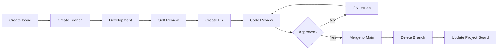

# Pull Request Guidelines

Руководство по созданию Pull Request для проекта **Information System of the Academic Secretary/Methodologist**

## 📋 Содержание

- [Общие принципы](#общие-принципы)
- [Подготовка к PR](#подготовка-к-pr)
- [Структура PR](#структура-pr)
- [Шаблон описания](#шаблон-описания)
- [Naming Conventions](#naming-conventions)
- [Code Review Process](#code-review-process)
- [Checklist перед созданием PR](#checklist-перед-созданием-pr)

## 🎯 Общие принципы

### Размер PR
- **Один PR = одна задача** из GitHub Projects
- Максимум **500 строк кода** (без тестов)
- Если больше - разбивайте на подзадачи

### Качество кода
- Код должен **проходить все тесты**
- **Линтеры** должны проходить без ошибок
- Добавляйте **тесты** для новой функциональности

### Связь с задачами
- PR должен **закрывать конкретную задачу** в GitHub Projects
- Используйте **keywords** для автоматического закрытия issues

## 🚀 Подготовка к PR

### 1. Создание ветки
```bash
# Создание ветки от main
git checkout main
git pull origin main
git checkout -b feature/issue-123-user-authentication

# Naming pattern:
# feature/issue-{номер}-{краткое-описание}
# bugfix/issue-{номер}-{краткое-описание}  
# hotfix/issue-{номер}-{краткое-описание}
```

### 2. Коммиты
```bash
# Формат коммита:
git commit -m "feat(auth): implement JWT authentication system

- Add JWT token generation and validation
- Create middleware for protected routes
- Add user session management
- Update API documentation

Closes #123"
```

### 3. Префиксы коммитов
- `feat:` - новая функциональность
- `fix:` - исправление бага
- `docs:` - обновление документации
- `style:` - форматирование кода
- `refactor:` - рефакторинг
- `test:` - добавление тестов
- `chore:` - обновление зависимостей, конфигурации

## 📝 Структура PR

### Заголовок PR
```
[Issue #123] Implement user authentication system
```

**Формат**: `[Issue #{номер}] {Краткое описание}`

### Описание PR - используйте шаблон ниже

## 🔧 Шаблон описания

```markdown
## 📋 Описание

Краткое описание изменений в 1-2 предложениях.

## 🎯 Связанные задачи

Closes #123
Related to #124

## 🚀 Что изменено

### Backend (Go)
- [ ] Добавлена аутентификация JWT
- [ ] Создан middleware для защищенных роутов
- [ ] Обновлена схема базы данных

### Frontend (Next.js)
- [ ] Создан компонент LoginForm
- [ ] Добавлена страница /login
- [ ] Обновлен AuthContext

### Database
- [ ] Миграция для таблицы users
- [ ] Индексы для email и username

## 🧪 Тестирование

### Как тестировать
1. Запустите `docker-compose up`
2. Перейдите на `/login`
3. Введите тестовые данные: `test@example.com / password123`
4. Проверьте редирект на дашборд

### Автотесты
- [ ] Unit тесты: `go test ./...`
- [ ] Frontend тесты: `npm test`
- [ ] E2E тесты: `npm run test:e2e`

## 📱 Скриншоты

### До


### После  


## ⚠️ Breaking Changes

- Изменен API endpoint `/api/auth` → `/api/v1/auth`
- Требуется переменная окружения `JWT_SECRET`

## 📚 Документация

- [ ] README обновлен
- [ ] API документация обновлена
- [ ] Добавлены комментарии в код

## ✅ Checklist

- [ ] Код проходит линтеры (`golangci-lint`, `eslint`)
- [ ] Все тесты проходят
- [ ] Нет конфликтов с main веткой
- [ ] PR связан с issue в GitHub Projects  
- [ ] Добавлены/обновлены тесты
- [ ] Документация обновлена
- [ ] Локально протестировано
```

## 🏷️ Naming Conventions

### Ветки
```
feature/issue-123-user-authentication
bugfix/issue-456-login-validation
hotfix/issue-789-security-patch
docs/issue-101-api-documentation
refactor/issue-202-auth-middleware
```

### PR Labels
Используйте следующие лейблы:
- `🚀 feature` - новая функциональность
- `🐛 bugfix` - исправление багов
- `📚 documentation` - обновление документации  
- `🔧 refactor` - рефакторинг кода
- `🧪 tests` - добавление тестов
- `⚡ performance` - улучшение производительности
- `🔒 security` - вопросы безопасности
- `🎨 ui/ux` - изменения интерфейса

### Размер PR
- `size/S` - до 100 строк
- `size/M` - 100-300 строк  
- `size/L` - 300-500 строк
- `size/XL` - 500+ строк (требует разбиения)

## 👥 Code Review Process

### Для автора PR

1. **Self-review** - просмотрите PR самостоятельно
2. **Назначьте reviewers** (минимум 1, оптимально 2)
3. **Отвечайте на комментарии** в течение 24 часов
4. **Resolve conversations** после исправлений

### Для reviewers

1. **Review в течение 48 часов**
2. **Проверьте**:
   - Соответствие требованиям задачи
   - Качество кода и архитектуру
   - Покрытие тестами
   - Документацию
3. **Оставляйте конструктивные комментарии**
4. **Используйте GitHub suggestions** для мелких правок

### Типы review
- ✅ **Approve** - готово к мержу
- 💬 **Comment** - вопросы/предложения, но можно мержить
- ❌ **Request changes** - нужны исправления

## ✅ Checklist перед созданием PR

### Код
- [ ] Код соответствует style guide проекта
- [ ] Удалены `console.log` / `fmt.Println` для отладки
- [ ] Нет закомментированного кода
- [ ] Переменные и функции имеют понятные имена
- [ ] Добавлены необходимые комментарии

### Тесты
- [ ] Написаны unit тесты для новой функциональности
- [ ] Обновлены существующие тесты при изменении логики
- [ ] Все тесты проходят локально
- [ ] E2E тесты обновлены при изменении UI

### Документация
- [ ] README обновлен (если нужно)
- [ ] API документация обновлена
- [ ] Комментарии в коде добавлены
- [ ] CHANGELOG обновлен (для релизов)

### Git
- [ ] Ветка создана от актуального main
- [ ] Нет merge конфликтов
- [ ] История коммитов чистая (squash если нужно)
- [ ] PR связан с issue через "Closes #123"

### Безопасность
- [ ] Нет hard-coded паролей/токенов
- [ ] Переменные окружения добавлены в .env.example
- [ ] Валидация входных данных добавлена
- [ ] SQL инъекции предотвращены

## 🔄 Workflow схема


## 🎨 Примеры хороших PR

### Пример 1: Feature PR
- **Заголовок**: `[Issue #45] Add document upload functionality`
- **Размер**: 250 строк
- **Тесты**: ✅ Покрытие 90%
- **Документация**: ✅ API docs обновлены

### Пример 2: Bugfix PR  
- **Заголовок**: `[Issue #67] Fix user authentication redirect loop`
- **Размер**: 50 строк
- **Репродукция**: ✅ Steps to reproduce в описании
- **Тесты**: ✅ Регрессионный тест добавлен

---

**Помните**: качественный PR экономит время всей команды! 🚀